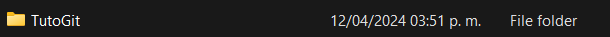
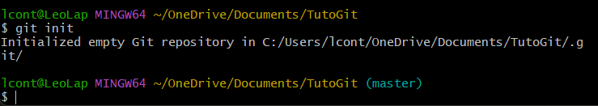
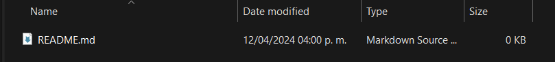
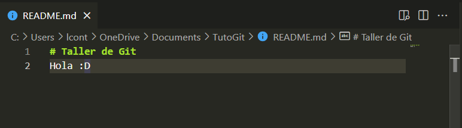
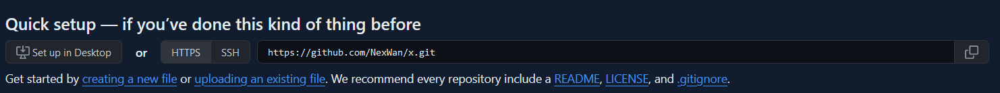

# PRIMERA CLASE

Para realizar tu primer commit recuerda estos pasos:
## Preparar tu carpeta/entorno
Crea una carpeta donde va a estar almacenado tu repo

Dentro de esta carpeta inicializa tu repositorio de git
- Abre tu consola (puede ser tanto con CMD como con git bash)
    - Si por ejemplo tu carpeta esta en (C:\Users\lcont\OneDrive\Documents\TutoGit) en git bash puedes hacer el siguiente comando: cd OneDrive\Documents\TutoGit. <br>
    Por defecto la consola de git inicia desde C:\Users\<usuario>\ 
- Dentro de tu consola ejecutar el comando 
```
git init
```
- Una vez que el comando se haya ejecutado tu consola deberia verse asi

- Una vez que este asi tu consola en tu carpeta crea un nuevo archivo llamado README.md

- Dentro del readme.md escribir una pequeña descripcion rapida usando la sintaxis de Markdown

- Una vez asegurado de que esten tus datos escritos, escribe los siguientes comando:
``` bash
git add README.md
git commit -m "first commit"
git branch -M main
git remote add origin https://github.com/NexWan/x.git #<- aqui va el link de tu repo
git push -u origin main
```

Y con eso ya habras ejecutado tu primer commit (y push) hacia github mediante git!

### IMPORTANTE
El link que tienes que poner en "git remote add origin < link >" tiene que ser el que te da en github que termina en .git, no tal cual el link a tu repositorio que te da el navegador


