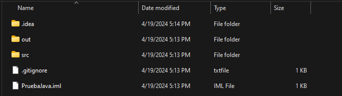
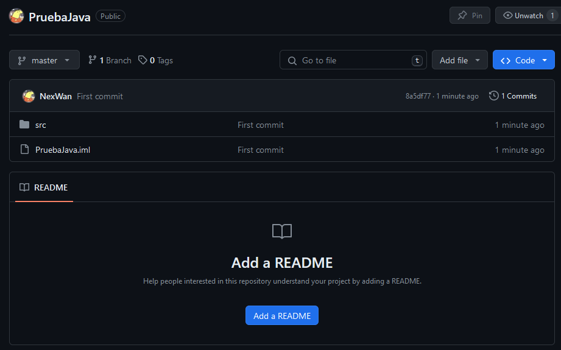

# SEGUNDA CLASE - BRANCHES
En esta clase se abordo el que son las ramas, como se crean las ramas y para que nos pueden servir las ramas.

## COMANDOS BASICOS QUE VIMOS PARA LAS RAMAS
- <b>git branch < nombre de la rama >:</b><br>
Este comando crea una rama con el nombre que le demos.
- <b>git branch:</b><br>
Este comando te muestra en una lista todas las ramas disponibles
- <b>git checkout < nombre de la rama > </b>:<br>
Este comando cambia a la rama especificada
- <b>git merge < nombre de la rama > </b>: <br>
Fusiona la rama especificada con la actual (se vera en la tercera clase)
- <b>git branch -d < nombre de la rama >:</b> <br>
Elimina la rama especificada (Solo si esta fusionada con main o master)
- <b>git branch -D < nombre de la rama >:</b> <br>
Elimina la rama aunque no haya sido mezclada.
- <b>git pull origin < rama remota >:</b> <br>
Este comando arrastra los cambios de una rama remota hacia tu rama local
- <b>git push --delete < nombre de la rama >:</b> <br>
Este comando borra la rama remotamente.

## ACTIVIDAD QUE HICIMOS

En base a un proyecto que tengamos de programacion (Ya sea en java o lo que sea) subir ese proyecto a Github mediante git.

1. **IDENTIFICAR TU CARPETA RAIZ DEL PROYECTO**  
  
En esta carpeta abriras tu consola de git bash  

2. **ABRIR LA CONSOLA Y SUBIR TUS ARCHIVOS A MAIN**  
  
Una vez tengas abierta tu consola seguir los pasos para subir tus archivos, si no los recuerdas puedes verlo en la [primera clase](https://github.com/NexWan/TallerGit/blob/main/1eraClase.md)  
3. **VERIFICAR LA RAMA Y EL REPOSITORIO**  
Una vez que hayas hecho los pasos basicos para subir tus archivos verifica que si se hayan subido a tu repositorio remoto en GitHub  
  
  
Como podemos ver los archivos ya existen en nuestro repo, si se dan cuenta arriba a la izquierda aparece una lista con las ramas, en este caso solo existe master, vamos a cambiar esto.  
4. **CREAR UNA NUEVA RAMA**
Ya que tenemos nuestro projecto de programacion subido, creemos una nueva rama con el comando   
```bash
git branch dev
```  
Este comando creara una nueva rama llamada "dev", ahora cambiemos a esta rama  
```bash
git checkout dev
```  
  
Como podemos ver, si usamos el comando "git branch" aparecera la rama master y la de dev, el asterisco especificara en que rama estamos (ademas de el parentesis a lado de la consola.)  
5. **RAMAS EN ACCION**  
Ya creamos la rama, pero, de que nos sirve? A la hora de hacer modificaciones a nuestro proyecto en la rama por ejemplo dev, estos no afectaran a la rama main. Hagamos una prueba. (De preferencia usa Visual Studio Code para visualizar los cambios de forma mas intuitiva).  
  
En mi caso, para mi rama tanto de dev y main solo existen estos archivos, si usas VSCODE (O cualquier ide con soporte de git) podras visualizar en algun lado en que rama estas, en el caso de VScode abajo a la izquierda.  
  
Ahi se puede observar que estamos en dev. Ahora creemos un archivo nuevo en la rama de dev y hagamos un push.  
   
Ya hemos creado un nuevo archivo! ahora vayamos a la consola y agreguemoslo.  
   
Si analizamos la imagen podemos ver que el mensaje indica que se creo una nueva rama remotamente (**MUY IMPORTANTE EN GIT PUSH -U ORIGIN < RAMA > PONER LA RAMA EN LA QUE ESTAS TRABAJANDO**), ahora vayamos a nuestro repositorio a ver la rama que creamos!   
  
En el menu de ramas ahora veremos la rama de dev!   
Y si hacemos un cambio de rama (checkout) veremos como en la rama main (o master) no existe el archivo de "prueba.java"  

   
  
Eso es por que las ramas NO afectan a la hora de desarrollar lo de otras ramas!. Ahora veamos como agregar los cambios de una rama a otra.  
6. **AGREGAR CAMBIOS DE OTRA RAMA**   

Usando el comando 
```bash
git pull origin < rama remota >
```  
podremos agregar los cambiso de una rama a la que estamos trabajando! en este caso queremos agregar los cambios de dev a main.  
   
Ahora si nos vamos a nuestro editor, veremos el archivo de prueba.java en nuestra rama main   
  
Ahora subamos los cambios a GitHub con un push

  
  
  
Como podemos ver, en el repositorio remoto ya tenemos en master los archivos extra de dev!  
Ahora eliminemos la rama de dev.  
7. **ELIMINAR UNA RAMA**  
Con el comando de  
```bash
git branch -d < rama >
```  
Podemos eliminar una rama **LOCALMENTE**  
  
Pero en GitHub no se eliminara, como lo hacemos? pues con el comando  
```bash
git push -u origin --delete dev
```  
Con este comando eliminaremos la rama "dev" del repositorio origen (en este caso el remoto, o sea github).  
  
  
Como podemos ver, ya no existe la rama dev en el repo remoto!  